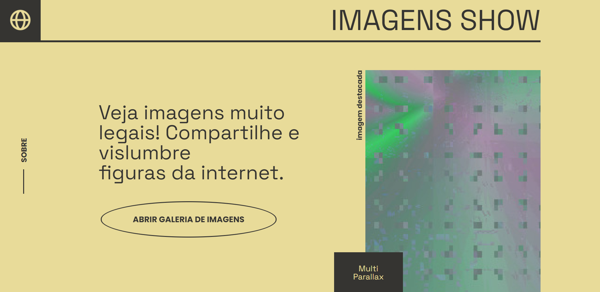

</p><p align="center">
 <a href="#">
  
 </a>
</p>

<p align="center">
 <a href="https://imagens-show.ga/">
  Abrir Projeto
 </a>

## Time
 - Eduardo Treichel
 - Maicon Santos
 - Pietro
 - Valdecir Junior
 - Vitor Petri

## Tecnologias
  - Javascript
  - Sass
  - Animate css

## Instalação

Para ter uma cópia local instalada e funcionando, siga estas etapas simples.

1. Clonar o repositório
   ```sh
   git clone https://github.com/vitorpetri/galeria-imagens-show.git
   ```
2. Iniciar o Sass
   ```sh
   npm run sass
   ```

[Documentação](https://github.com/vitorpetri/galeria-imagens-show) da Galeria

<p align="right">(<a href="#top">back to top</a>)</p>
